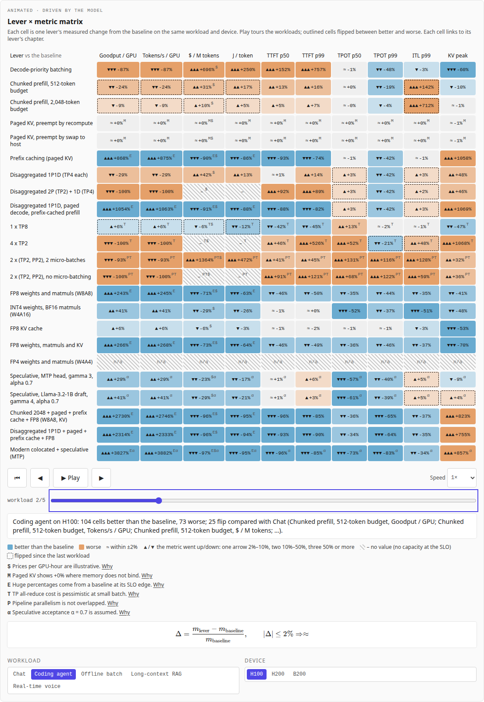
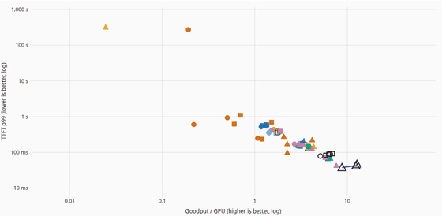
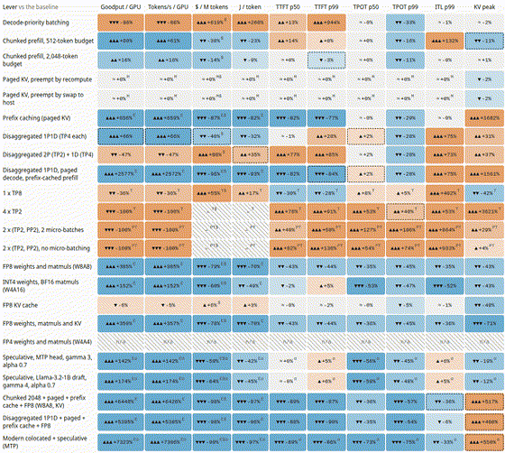
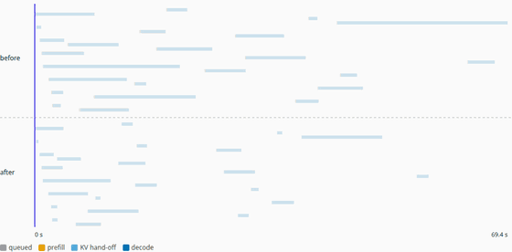
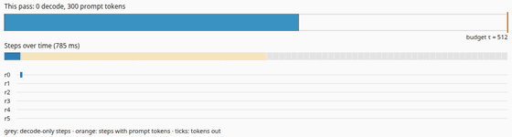
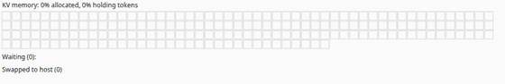
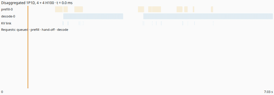
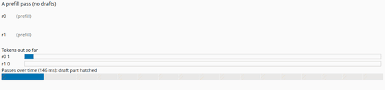
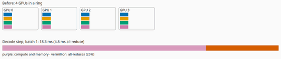
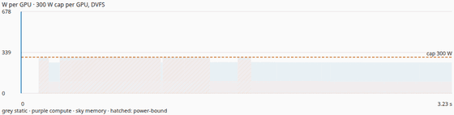

# Inference Trade-offs Explained

Architectural trade-offs in LLM inference, measured. Serving a language
model is a stack of decisions: how to batch, how to hold the KV cache,
whether to split prefill from decode, how to split the model across GPUs,
which number formats, whether to draft tokens speculatively. Each lever helps
some measures and costs others, and the answer changes with the workload.
This site is organised around those decisions, and **nothing on it is
asserted**: every number comes from a recorded sweep of
[Disaggregated_Inference_Sim](https://github.com/BrendanJamesLynskey/Disaggregated_Inference_Sim)
(23 levers and the baseline × 5 workloads × 3 devices = 350 configurations
of the same 8 GPUs serving Llama-3-70B), and the live what-if runs the
simulator's own JavaScript engine, which reproduces the sweep's recorded
latencies bit for bit.

It is the seventh of a family of companion sites: the
[Transformer Decoder Explainer](https://transformer-decoder-explained.vercel.app/)
shows one forward pass, [LLM Inference Explained](https://llm-inference-explained.vercel.app/)
shows how serving works, [LLM Architectures Explained](https://llm-architectures-explained.vercel.app/)
shows how the models differ, [GPU Kernels Explained](https://gpu-kernels-explained.vercel.app/)
shows how a GPU runs the maths, [Numerics Explained](https://numerics-explained.vercel.app/)
is about the number formats (and accuracy, which this site does not
simulate), [Systolic Arrays Explained](https://systolic-arrays-explained.vercel.app/)
is the silicon underneath, and this site is about the decisions. They share
one design system and link to each other from the header, in two groups:
"LLM systems" (Decoder · Inference · Architectures · Kernels · Numerics ·
Silicon · Trade-offs) and "Agents", which starts with
[Agent Harnesses Explained](https://agent-harnesses-explained.vercel.app/)
(the loop, tools, context and permissions that turn a model into an agent;
five more agent sites are marked "soon").

**Live:** [inference-tradeoffs-explained.vercel.app](https://inference-tradeoffs-explained.vercel.app/)



## Part of

The other companion sites are listed in the
[LLMs](https://github.com/BrendanJamesLynskey/LLMs) hub. The simulator
behind this one is introduced in the
[Inference Simulators](https://brendanjameslynskey.github.io/LLM_Hub_Inference_Simulators/)
slide series.

## The tools

| Page                                                                                | What it does                                                                                                                                                                                                                                                                                                                    |
| ----------------------------------------------------------------------------------- | ------------------------------------------------------------------------------------------------------------------------------------------------------------------------------------------------------------------------------------------------------------------------------------------------------------------------------- |
| [Pareto explorer](https://inference-tradeoffs-explained.vercel.app/explore)         | Pick any two metrics, a workload and the devices: every configuration is a point, the front is drawn, and changing the workload or tightening the SLO filter animates the points and the front to their new places. Hover for the configuration; click to re-run it live.                                                       |
| [Lever × metric matrix](https://inference-tradeoffs-explained.vercel.app/matrix)    | Every lever against every metric: a colour and a glyph for the measured change from the baseline (sign and size), per workload and device. Touring the workloads outlines the cells that flip; every cell links to its lever's chapter.                                                                                         |
| [Live what-if](https://inference-tradeoffs-explained.vercel.app/what-if)            | Start from a sweep configuration, toggle levers, and re-run the vendored engine in a Web Worker on the very requests the sweep used: before/after bars, where the time went, and a timeline animation of the same requests under both configurations.                                                                           |
| [The levers](https://inference-tradeoffs-explained.vercel.app/learn)                | Thirteen chapters, one per lever: each opens with its mechanism animated from states the simulator recorded (or its cost model, live), then its row of the matrix (or the simulator's recorded results in the same colours), why it behaves as measured, with links to the Kernels, Numerics and Silicon sites, and its papers. |
| [Workload case studies](https://inference-tradeoffs-explained.vercel.app/workloads) | Chat, a coding agent, offline batch, long-context RAG and real-time voice: the configuration that serves each best under its SLOs (on any device, on each device, cheapest), its Pareto front, and the levers whose effect changes sign against the other workloads.                                                            |
| [Method](https://inference-tradeoffs-explained.vercel.app/method)                   | How the sweep was run: the cluster, the levers, capacity under SLOs, the workloads and their sources, the devices and illustrative prices, every caveat, and the vendored files' hashes.                                                                                                                                        |

## Animations

Recorded from the site with `pnpm animations` (each frame is a state set
through the animation's scrub bar; WebM versions alongside, in
[`docs/media/`](docs/media/)).

| Pareto explorer, touring the workloads                                     | Matrix, touring the workloads                                           | What-if timeline                                                                                        |
| -------------------------------------------------------------------------- | ----------------------------------------------------------------------- | ------------------------------------------------------------------------------------------------------- |
|  |  |  |

The chapters' mechanisms, each frame a state the simulator recorded (or, for
the all-reduce, its cost model):

| Chunked prefill (chapter 1)                                                                                  | Paged KV and preemption (chapter 2)                                                          | Disaggregated pools (chapter 4)                                                                           |
| ------------------------------------------------------------------------------------------------------------ | -------------------------------------------------------------------------------------------- | --------------------------------------------------------------------------------------------------------- |
|  |  |  |

| Speculative decoding (chapter 10)                                                              | Ring all-reduce (chapter 8)                                                                     | Power under a cap (chapter 11)                                                 |
| ---------------------------------------------------------------------------------------------- | ----------------------------------------------------------------------------------------------- | ------------------------------------------------------------------------------ |
|  |  |  |

## Where the numbers come from, and how that is checked

- **One number source.** `scripts/vendor-tradeoffs.ts` copies three files
  from the simulator at one commit, byte for byte (`git show`), and records
  their SHA-256 in `src/lib/tradeoffs/vendor/VENDORED.json`:
  `examples/tradeoffs.json` (the sweep), `web/sim_engine.js` (the engine) and
  `examples/results.md`. Prose numbers are looked up from the data at build
  time (`<V of="…">`); a unit test fails if a page spells out a number by hand.
- **Engine parity.** `scripts/tradeoffs_reference.py` runs the simulator's
  Python package at the vendored commit on fourteen sweep configurations
  (every lever family, workload and device) and records a SHA-256 of every
  request's timestamps; the unit tests run the vendored engine on each
  point's recorded configuration and must produce the same digest. It also
  records the workloads exactly as the sweep generated them at each
  workload's reference load (`public/tradeoffs/workloads/`), which the
  what-if replays.
- **The sweep, re-run.** For all 350 points the engine on the recorded
  workload reproduces the point's TTFT, TPOT and ITL p50/p99 exactly, and the
  what-if's toggles produce exactly the point's configuration.
- **Derived views.** The explorer's front equals the sweep's own Pareto flags
  for every pair of metrics and workload; every relative change results.md
  section 26 prints is what the matrix prints, and the levers whose goodput
  changes sign are the same.
- **The chapters' mechanisms.** `scripts/mechanisms_reference.py` runs nine
  small named scenarios through the simulator's Python package at the
  vendored commit and records every forward pass of every instance (each
  running row's prompt and output progress, the KV in use, the prefix cache,
  preemptions, hand-offs, step energy) into `public/tradeoffs/mechanisms/`,
  without changing the run (it re-runs each scenario unrecorded and requires
  the same timestamps). The chapter animations draw those records; the unit
  tests run the vendored engine on every scenario and require the same
  request timestamps bit for bit, and check at least three key frames of
  every animation against the record (decode rows and prompt tokens against
  the step's own label, KV cells against the KV in use, the hit rate and
  tokens per verify pass against the simulator's statistics, peak power
  against the engine's). The parallelism and quantisation animations call
  the engine's cost model live; `cost_model.json` holds the Python cost
  model's steps and the tests require the same numbers. Results the sweep
  does not vary (heterogeneous and optical pools, links, CED, power caps)
  are quoted cell by cell from the vendored results.md (`md|…` value paths).
- **Animations** are sequences of states computed from the data; a frame is
  a pure function of (state, t), key frames are unit-tested (the timeline's
  against the Python timestamps), and every animation has play/pause, step,
  scrub, speed and reset, keyboard control and an `aria-live` caption. With
  reduced motion nothing plays by itself.
- CI: lint and types, unit tests with coverage thresholds, the data job
  (checks out the simulator at the vendored commit, checks the three files
  and regenerates the fixtures and the chapters' recorded states, which must
  not change), e2e on a production
  build (pages, animations, the tools, axe, light/dark, 1280/390 px) and
  Lighthouse.

## What is illustrative

These are labelled on the site wherever the numbers they affect appear
(a letter beside a matrix cell, the list under each chart, and in full on
the method page):

- **Pipeline parallelism is not overlapped** across steps, so every PP
  configuration loses.
- **The TP all-reduce cost is pessimistic at small batch** (a first-order
  α–β ring model whose per-hop latency dominates; not calibrated against
  nccl-tests).
- **Paged KV shows +0% where memory does not bind** (Llama-3-70B on four GPUs
  per instance never runs out of KV at these loads).
- **Huge percentage gains come from a baseline at its SLO edge** (voice and
  the coding agent especially).
- **Prices per GPU-hour are illustrative**, the speculative **acceptance
  rate α is assumed**, and **B200's BF16 rate and power coefficients are
  illustrative**.
- The roofline efficiencies and power coefficients of the simulator's cost
  model are illustrative, and accuracy is not simulated.
- The chapters' scenarios are small and chosen to show each mechanism (a
  few requests, named in each animation); the optical prefill pool is a
  hypothetical device with illustrative coefficients, the in-transit
  compression stage is illustrative, and the CED model is a dense proxy of
  the paper's design.

## Develop

```bash
pnpm install
pnpm dev                      # http://localhost:3000
pnpm test                     # unit tests (about a minute: 350 simulations)
pnpm test:e2e                 # e2e on a production build
pnpm smoke [url]              # post-deploy smoke check
pnpm mechanisms               # re-record the chapters' scenarios (simulator venv)
```

Updating the data, deploying and checking a deploy: [RUNBOOK.md](RUNBOOK.md).

## Origin

Copied from [systolic-arrays-explained](https://github.com/BrendanJamesLynskey/systolic-arrays-explained)
@ `fe6daab` (layout, animation clock and panel, controls, site switch, CI,
e2e and Lighthouse set-up), with its content removed; the simulator wrapper,
Web Worker and vendoring pattern follow
[llm-inference-explained](https://github.com/BrendanJamesLynskey/llm-inference-explained).

## References

- Zhong et al., DistServe (goodput under SLOs): [arXiv:2401.09670](https://arxiv.org/abs/2401.09670)
- Agrawal et al., Sarathi-Serve (chunked prefill): [arXiv:2403.02310](https://arxiv.org/abs/2403.02310)
- Kwon et al., vLLM / PagedAttention: [arXiv:2309.06180](https://arxiv.org/abs/2309.06180)
- Leviathan et al., speculative decoding: [arXiv:2211.17192](https://arxiv.org/abs/2211.17192)
- Stivers et al., turn-taking in conversation: [doi:10.1073/pnas.0903616106](https://doi.org/10.1073/pnas.0903616106)
- Zheng et al., SGLang / RadixAttention: [arXiv:2312.07104](https://arxiv.org/abs/2312.07104)
- Patel et al., Splitwise: [arXiv:2311.18677](https://arxiv.org/abs/2311.18677)
- Shoeybi et al., Megatron-LM: [arXiv:1909.08053](https://arxiv.org/abs/1909.08053); Huang et al., GPipe: [arXiv:1811.06965](https://arxiv.org/abs/1811.06965); Lepikhin et al., GShard: [arXiv:2006.16668](https://arxiv.org/abs/2006.16668); Patarasuk and Yuan, ring all-reduce: [doi:10.1016/j.jpdc.2008.09.002](https://doi.org/10.1016/j.jpdc.2008.09.002)
- Lin et al., AWQ: [arXiv:2306.00978](https://arxiv.org/abs/2306.00978); Rouhani et al., MX formats: [arXiv:2310.10537](https://arxiv.org/abs/2310.10537)
- DeepSeek-AI, DeepSeek-V3 (MTP): [arXiv:2412.19437](https://arxiv.org/abs/2412.19437); DeepSeek-V4.1-Flash (CED): [arXiv:2609.19969](https://arxiv.org/abs/2609.19969)
- Liu et al., KIVI: [arXiv:2402.02750](https://arxiv.org/abs/2402.02750); Hooper et al., KVQuant: [arXiv:2401.18079](https://arxiv.org/abs/2401.18079); Kai et al., FreqKV: [arXiv:2505.00570](https://arxiv.org/abs/2505.00570)
- Stojkovic et al., DynamoLLM: [arXiv:2408.00741](https://arxiv.org/abs/2408.00741)
- Okabe and Ito, Color Universal Design: [jfly.uni-koeln.de/color](https://jfly.uni-koeln.de/color/)

## Licence

MIT.
